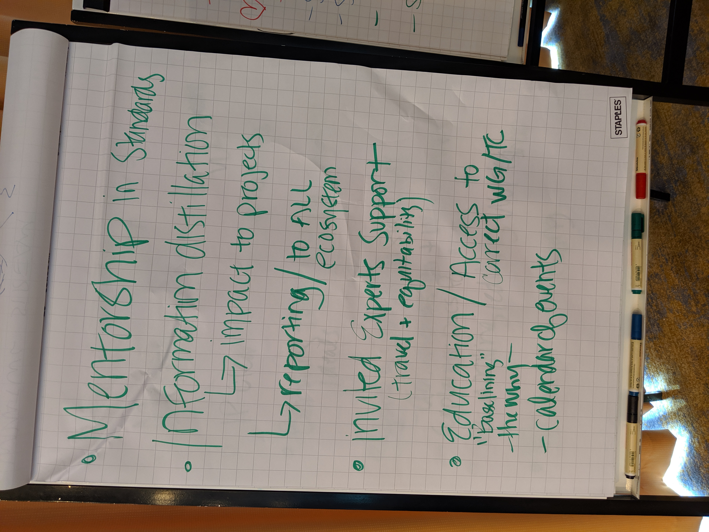
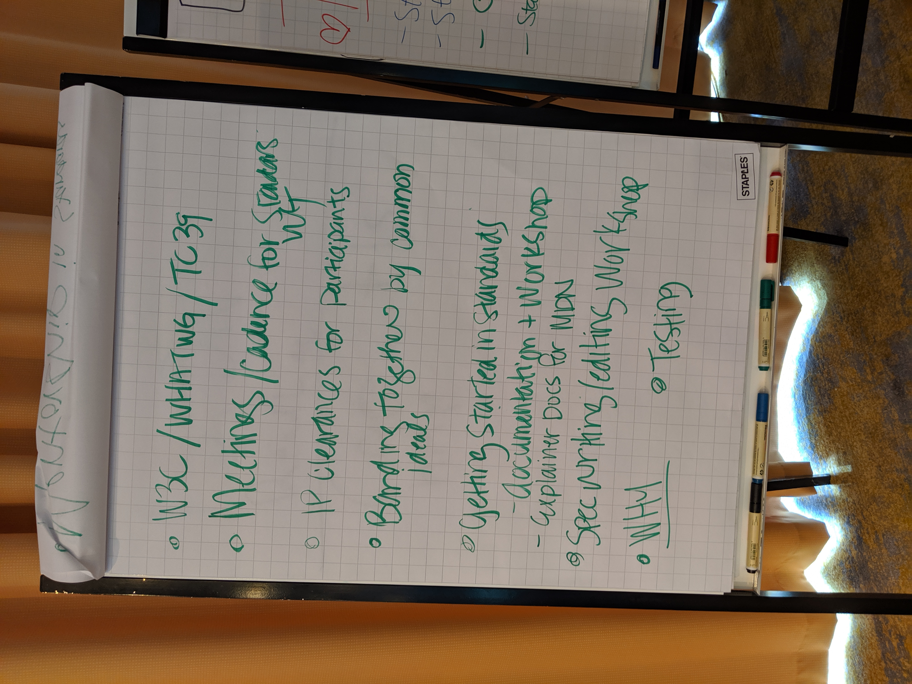
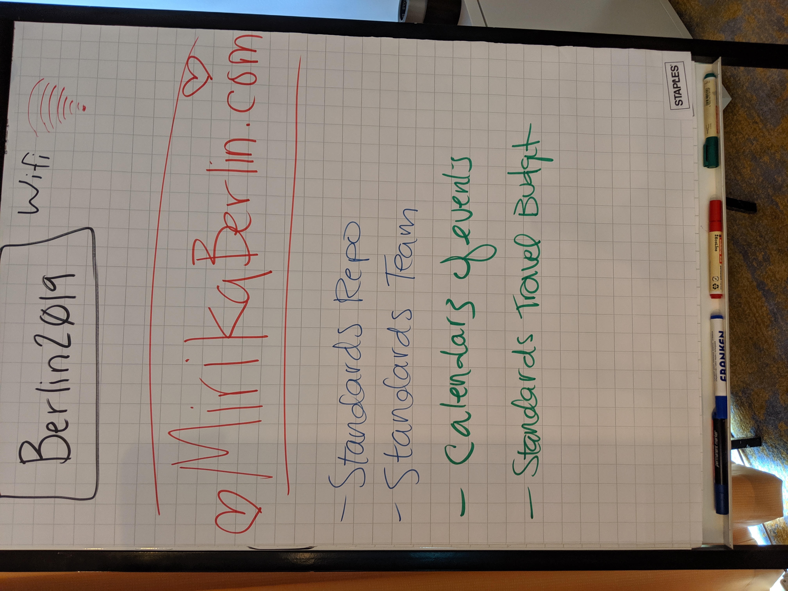

# Notes from the OpenJS Foundation Collaborator Summit

Date: 2019.05.31
Location: Berlin
Present: (Attendance was not taken; please make a PR to add your name if you wish to do so)
Reference Links:
* [proposal issue](https://github.com/nodejs/open-standards/issues/18)
* [slides](https://docs.google.com/presentation/d/1tW7y1G0XYrIzujS_u82WWU9iO8-H2gWZODJQUmfnF7w/edit)

## Notes

* @jorydotcom provided a brief overview of the JS Foundation's past and present participation at TC39 and W3C.
* @littledan, @jasnell, @mylesborins, @jorydotcom & others fielded questions about standards participation.
* The group brainstormed ideas for things a standards working group at the OpenJS Foundation could provide to the organization and community (see images below)
* The group came up with several next steps we can take to get started, including:

-[x] create a standards repo
-[] create a calendar of events 
-[] schedule another working meeting
-[] create a standards 'team' to collaborate on GH
-[] confirm standards travel budget (board follow-up)

*images of poster board notes*

